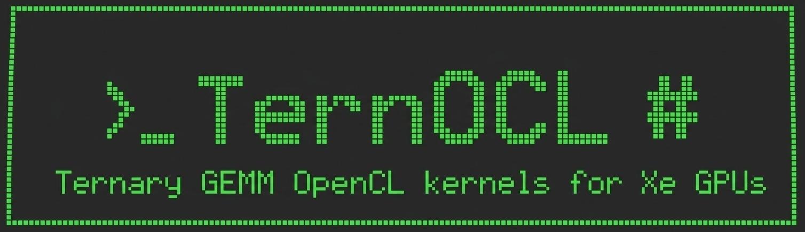

<p align="center">
  
</p>

# TernOCL

Standalone OpenCL C kernels for ternary (2-bit, `{-1, 0, +1}` x per-group
scale) weight GEMM/GEMV on Intel Xe2 GPUs (Arc Pro B70 / BMG, Arc 140V / Lunar
Lake). Each variant is a drop-in, validated replacement for the matching XeTLA
kernel of the vLLM xetla plugin: same data layouts, same numerics, same fused
epilogues. Each is benchmarked against that kernel on identical inputs.

| variant                                                | math                                                                                  | activations  | XeTLA counterpart                                            |
| ------------------------------------------------------ | ------------------------------------------------------------------------------------- | ------------ | ------------------------------------------------------------ |
| [int2_fp16_upcvt](int2_fp16_upcvt/)                     | int2 weights upconverted to fp16/bf16, fp16/bf16 DPAS, fp32 acc                       | fp16 or bf16 | `int2_fp16_upcvt_xmx_xe.hpp`                               |
| [int2_via_int2_x_int8_dpas](int2_via_int2_x_int8_dpas/) | activations quantized to int8 (per row and 128-group), native s8 x s2 DPAS, int32 acc | fp16 or bf16 | `int2_fp16_dpas_xmx_xe.hpp`, `int2_bf16_dpas_xmx_xe.hpp` |
| [bitcos_fp16_upcvt](bitcos_fp16_upcvt/)                 | BITCOS weights (presence bitmap + compacted signs, 2 - z bits/weight) unpacked through an SLM table, fp16/bf16 DPAS, fp32 acc | fp16 or bf16 | `bitcos_fp16_upcvt_xmx_xe.hpp` |

The int2 variants have a decode GEMV (M = 1..8) and a large-M GEMM (prefill), and
handle any M (ragged tiles are zero-filled on read and clipped on write).
They need `N % 16 == 0` and `K % 128 == 0`, with scale group size 128.
The BITCOS variant is a decode GEMV (M = 1..8) for now.

## Layout

```
common/            dt16.hpp (fp16/bf16 host helpers), epilogue.clh / epilogue.hpp (fused post-ops),
                   bitcos.hpp (BITCOS packer, slice ranks, decoder)
hadamard/          hadamard_fwht.cl: fused sign flip + blockwise 1024 Walsh-Hadamard input
                   transform for rotated-basis checkpoints (Bonsai 2), fp16 or bf16
int2_fp16_upcvt/   kernel, driver, Makefile, validate.sh, bench.sh, sweep_midm.sh (prompt-length M),
                   sweep_mt.sh (M >= 64), xetla_ref/ (XeTLA harness)
int2_via_int2_x_int8_dpas/
                   kernel, driver, Makefile, validate.sh, bench.sh, xetla_ref/ + xetla_ref_bf16/
bitcos_fp16_upcvt/ kernel, driver, Makefile, validate.sh, zsweep.sh (paper GEMV z sweep),
                   shapes27b.sh (Bonsai 27B shapes at one z)
tools/             xetla_epilogue_parity/ (bit-exact epilogue check and same-runtime GEMV bench
                   against the plugin's own kernel), tune_8b_small.sh
run_all.sh         validate / epilogues / bench for every variant, dtype and M
validate_epilogues.sh
```

## Build

Requirements: an Intel GPU driver with OpenCL (tested with the 26.35 runtime),
oneAPI 2026.0 (OpenCL headers and loader, `icpx` for the XeTLA references), and
the Intel OpenCL extensions `cl_intel_subgroups`,
`cl_intel_subgroup_matrix_multiply_accumulate`,
`cl_intel_subgroup_2d_block_io` and `cl_intel_required_subgroup_size`.

```bash
unset LD_LIBRARY_PATH
source /swtools/intel-gpu/latest/intel_gpu_vars.sh
source /swtools/intel/2026.0/oneapi-vars.sh --force

make -C int2_fp16_upcvt CXX=g++
make -C int2_via_int2_x_int8_dpas CXX=g++
make -C bitcos_fp16_upcvt CXX=g++

# XeTLA references (needs the xetla tree of the vLLM plugin)
export XETLA=/path/to/xetla_vllm_plugin/xetla
bash int2_fp16_upcvt/xetla_ref/build.sh
bash int2_via_int2_x_int8_dpas/xetla_ref/build.sh
bash int2_via_int2_x_int8_dpas/xetla_ref_bf16/build.sh
```

The drivers compile the kernels at run time from the `.cl` next to the binary
(`make` copies the kernel and `epilogue.clh` into `build/`).

## Validate and benchmark

```bash
bash run_all.sh validate epilogues                              # both variants, fp16 + bf16
DTYPES=fp16 MS="1 1024" bash run_all.sh bench                   # B70
PACE=15 DTYPES=fp16 MS="1 1024" bash run_all.sh bench           # Lunar Lake
VARIANT=int2_fp16_upcvt DTYPES=bf16 MS=1 bash run_all.sh bench  # one variant / dtype / M
```

The architecture (`b70` / `lnl`) comes from the hostname; set `ARCH=` to
override it. Results go to `<variant>/results/` and are not tracked.

### Methodology (both variants)

* **Rotating weights:** enough distinct weight sets (B + scales) to exceed
  `--weights-gib` (default 2 GiB), with one untimed warm-up pass over every
  set, so every timed call streams its weights from DRAM. The XeTLA references
  use the same set rule.
* **Timing:** device profiling events. For the int8 variant, the time includes
  the activation-quantization pre-kernel on both sides.
* **Reported number:** the tuned OpenCL tile is picked by a sweep per shape,
  then the OpenCL and XeTLA winners are re-measured alternately 3 times and
  the median is reported.
* **XeTLA configuration:** the upcvt reference runs the vLLM plugin's tuned
  per-arch dispatch (`csrc/int2_fp16_upcvt_kernel.sycl`). The int8 reference
  runs the best of its precompiled tiles.
* **XeTLA build flags:** default device compile flags. The plugin's `setup.py`
  backend flags (`-doubleGRF` etc.) do not reach its device image, so the
  defaults are what production runs.
* **Lunar Lake:** `PACE=15` sleeps before each re-measure, because
  shared-memory bandwidth drifts under sustained load.

Shapes: Bonsai 8B (Qwen3-8B: qkv 4096x6144, o_proj 4096x4096, gate_up
4096x24576, down 12288x4096, lm_head 4096x151680) and Bonsai 27B (Qwen3.5-27B:
gate_up 5120x34816, down 17408x5120, in_proj_qkvz 5120x16384, out_proj
6144x5120, qkv 5120x14336, lm_head 5120x248320).

## Fused epilogues

The same post-ops as the XeTLA plugin and OpenVINO integration
(`common/epilogue.clh`) are selected at compile time with `--postop`:

| POSTOP | epilogue                            |
| ------ | ----------------------------------- |
| 0      | none                                |
| 1      | `silu(acc) * other` (SwiGLU gate) |
| 2      | `acc + other` (residual)          |
| 3      | `acc + bias[n]`                   |
| 4      | `sigmoid(acc)`                    |

`--out-f32` writes fp32 C (and takes an fp32 bias), as for lm_head logits.
All post-ops work on the fp32 accumulator before the output cast, and sigmoid
matches `xetla_sigmoid`, including its clamp to 0 for `x <= -10`.
[tools/xetla_epilogue_parity](tools/xetla_epilogue_parity/) runs the plugin's
XeTLA kernel and the OpenCL kernel on the same device buffers. The results are
bit-identical for POSTOP 1-4, fp16 and bf16, and M = 1, 77 and 1024.

## Results (Arc Pro B70, fp16 activations)

Speed-up is XeTLA time / OpenCL time. The per-variant READMEs have per-shape
times, tiles and bf16 numbers.

| variant                                                                         | GEMV M = 1            | GEMM M = 1024        |
| ------------------------------------------------------------------------------- | --------------------- | -------------------- |
| int2_fp16_upcvt                                                                 | x1.01-1.05            | x4.4-4.9             |
| int2_via_int2_x_int8_dpas (vs XeTLA's int8 path, incl. activation quantization) | x1.35-3.7 (8B shapes) | x1.2-1.8 (27B, bf16) |
| bitcos_fp16_upcvt (vs XeTLA BITCOS, z = 0.40, 27B shapes)                       | x1.00-1.09            | -                    |

On the Arc 140V (Lunar Lake) the BITCOS kernel is x1.00-1.25 over XeTLA BITCOS
on the same 27B shapes.

The BITCOS reference is the paper's own XeTLA harness; see
[bitcos_fp16_upcvt/](bitcos_fp16_upcvt/) for the per-shape table and the
paper's zero-density GEMV sweep.

## License

BSD 3-Clause, see [LICENSE.md](LICENSE.md). The XeTLA-derived reference
harnesses are Apache-2.0 ([LICENSE.xetla](LICENSE.xetla)); see [NOTICE](NOTICE).
